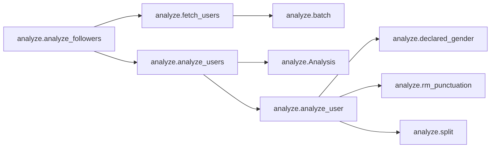
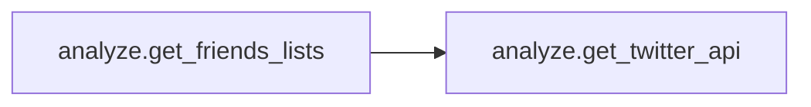
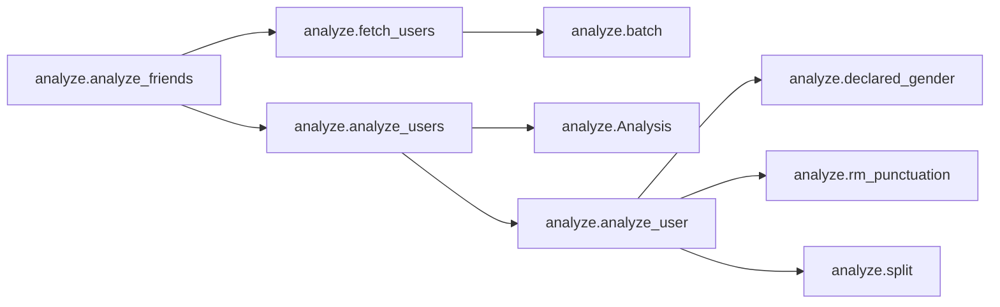
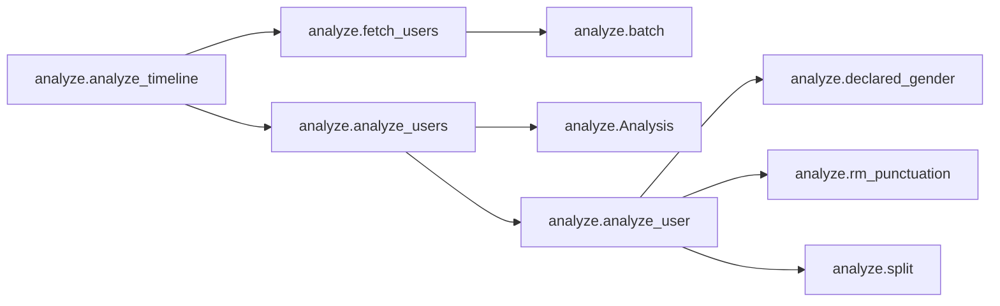
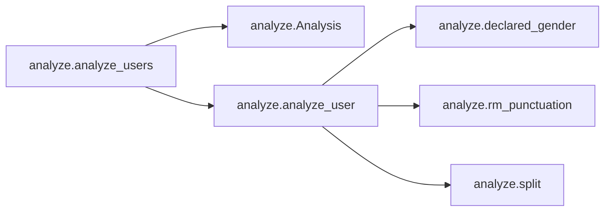
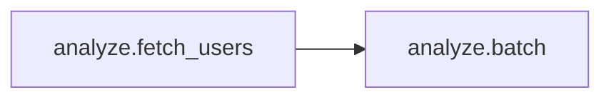
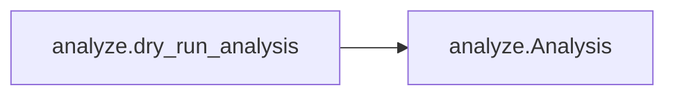

# Key Objects

[_Documentation generated by Documatic_](https://www.documatic.com)

<!---Documatic-section-analyze.analyze_followers-start--->
## analyze.analyze_followers

<!---Documatic-section-analyze_followers-start--->


### Object Calls

* analyze.fetch_users
* analyze.analyze_users

<!---Documatic-block-analyze.analyze_followers-start--->
<details>
	<summary><code>analyze.analyze_followers</code> code snippet</summary>

```python
def analyze_followers(user_id, api, cache):
    nxt = -1
    follower_ids = []
    for _ in range(MAX_GET_FOLLOWER_IDS_CALLS):
        (nxt, prev, data) = api.GetFollowerIDsPaged(screen_name=user_id, cursor=nxt)
        follower_ids.extend(data)
        if nxt == 0 or nxt == prev:
            break
    if len(follower_ids) > 100 * MAX_USERS_LOOKUP_CALLS:
        follower_id_sample = random.sample(follower_ids, 100 * MAX_USERS_LOOKUP_CALLS)
    else:
        follower_id_sample = follower_ids
    users = fetch_users(follower_id_sample, api, cache)
    return analyze_users(users, ids_fetched=len(follower_ids))
```
</details>
<!---Documatic-block-analyze.analyze_followers-end--->
<!---Documatic-section-analyze_followers-end--->

# #
<!---Documatic-section-analyze.analyze_followers-end--->

<!---Documatic-section-analyze.get_friends_lists-start--->
## analyze.get_friends_lists

<!---Documatic-section-get_friends_lists-start--->


### Object Calls

* analyze.get_twitter_api

<!---Documatic-block-analyze.get_friends_lists-start--->
<details>
	<summary><code>analyze.get_friends_lists</code> code snippet</summary>

```python
def get_friends_lists(user_id, consumer_key, consumer_secret, oauth_token, oauth_token_secret):
    api = get_twitter_api(consumer_key, consumer_secret, oauth_token, oauth_token_secret)

    def process_lists():
        for l in reversed(api.GetLists()):
            as_dict = l.AsDict()
            yield {'id': as_dict.get('id'), 'name': as_dict.get('name')}
    return list(process_lists())
```
</details>
<!---Documatic-block-analyze.get_friends_lists-end--->
<!---Documatic-section-get_friends_lists-end--->

# #
<!---Documatic-section-analyze.get_friends_lists-end--->

<!---Documatic-section-analyze.analyze_friends-start--->
## analyze.analyze_friends

<!---Documatic-section-analyze_friends-start--->


### Object Calls

* analyze.fetch_users
* analyze.analyze_users

<!---Documatic-block-analyze.analyze_friends-start--->
<details>
	<summary><code>analyze.analyze_friends</code> code snippet</summary>

```python
def analyze_friends(user_id, list_id, api, cache):
    nxt = -1
    friend_ids = []
    for _ in range(MAX_GET_FRIEND_IDS_CALLS):
        if list_id is not None:
            (nxt, prev, data) = api.GetListMembersPaged(list_id=list_id, cursor=nxt)
            friend_ids.extend([fr.id for fr in data])
        else:
            (nxt, prev, data) = api.GetFriendIDsPaged(screen_name=user_id, cursor=nxt)
            friend_ids.extend(data)
        if nxt == 0 or nxt == prev:
            break
    if len(friend_ids) > 100 * MAX_USERS_LOOKUP_CALLS:
        friend_id_sample = random.sample(friend_ids, 100 * MAX_USERS_LOOKUP_CALLS)
    else:
        friend_id_sample = friend_ids
    users = fetch_users(friend_id_sample, api, cache)
    return analyze_users(users, ids_fetched=len(friend_ids))
```
</details>
<!---Documatic-block-analyze.analyze_friends-end--->
<!---Documatic-section-analyze_friends-end--->

# #
<!---Documatic-section-analyze.analyze_friends-end--->

<!---Documatic-section-analyze.Analysis-start--->
## analyze.Analysis

<!---Documatic-section-Analysis-start--->
<!---Documatic-block-analyze.Analysis-start--->
<details>
	<summary><code>analyze.Analysis</code> code snippet</summary>

```python
class Analysis(object):

    def __init__(self, ids_sampled, ids_fetched):
        self.nonbinary = Stat()
        self.male = Stat()
        self.female = Stat()
        self.andy = Stat()
        self.ids_sampled = ids_sampled
        self.ids_fetched = ids_fetched

    def update(self, gender, declared):
        attr = getattr(self, 'andy' if gender == 'unknown' else gender)
        attr.n += 1
        if declared:
            attr.n_declared += 1

    def guessed(self, gender=None):
        if gender:
            attr = getattr(self, gender)
            return attr.n - attr.n_declared
        return self.guessed('nonbinary') + self.guessed('male') + self.guessed('female')

    def declared(self, gender=None):
        if gender:
            attr = getattr(self, gender)
            return attr.n_declared
        return self.nonbinary.n_declared + self.male.n_declared + self.female.n_declared

    def pct(self, gender):
        attr = getattr(self, gender)
        return div(100 * attr.n, self.nonbinary.n + self.male.n + self.female.n)
```
</details>
<!---Documatic-block-analyze.Analysis-end--->
<!---Documatic-section-Analysis-end--->

# #
<!---Documatic-section-analyze.Analysis-end--->

<!---Documatic-section-analyze.analyze_timeline-start--->
## analyze.analyze_timeline

<!---Documatic-section-analyze_timeline-start--->


### Object Calls

* analyze.fetch_users
* analyze.analyze_users

<!---Documatic-block-analyze.analyze_timeline-start--->
<details>
	<summary><code>analyze.analyze_timeline</code> code snippet</summary>

```python
def analyze_timeline(user_id, list_id, api, cache):
    if list_id is not None:
        statuses = api.GetListTimeline(list_id=list_id, count=200)
    else:
        statuses = api.GetHomeTimeline(count=200)
    timeline_ids = []
    for s in statuses:
        if s.user.screen_name != user_id:
            timeline_ids.append(s.user.id)
    timeline_ids = list(set(timeline_ids))
    users = fetch_users(timeline_ids, api, cache)
    return analyze_users(users, ids_fetched=len(timeline_ids))
```
</details>
<!---Documatic-block-analyze.analyze_timeline-end--->
<!---Documatic-section-analyze_timeline-end--->

# #
<!---Documatic-section-analyze.analyze_timeline-end--->

<!---Documatic-section-analyze.analyze_users-start--->
## analyze.analyze_users

<!---Documatic-section-analyze_users-start--->


### Object Calls

* analyze.Analysis
* analyze.analyze_user

<!---Documatic-block-analyze.analyze_users-start--->
<details>
	<summary><code>analyze.analyze_users</code> code snippet</summary>

```python
def analyze_users(users, ids_fetched=None):
    an = Analysis(ids_sampled=len(users), ids_fetched=ids_fetched)
    for user in users:
        (g, declared) = analyze_user(user)
        an.update(g, declared)
    return an
```
</details>
<!---Documatic-block-analyze.analyze_users-end--->
<!---Documatic-section-analyze_users-end--->

# #
<!---Documatic-section-analyze.analyze_users-end--->

<!---Documatic-section-analyze.div-start--->
## analyze.div

<!---Documatic-section-div-start--->
<!---Documatic-block-analyze.div-start--->
<details>
	<summary><code>analyze.div</code> code snippet</summary>

```python
def div(num, denom):
    if denom:
        return num / float(denom)
    return 0
```
</details>
<!---Documatic-block-analyze.div-end--->
<!---Documatic-section-div-end--->

# #
<!---Documatic-section-analyze.div-end--->

<!---Documatic-section-analyze.fetch_users-start--->
## analyze.fetch_users

<!---Documatic-section-fetch_users-start--->


### Object Calls

* analyze.batch

<!---Documatic-block-analyze.fetch_users-start--->
<details>
	<summary><code>analyze.fetch_users</code> code snippet</summary>

```python
def fetch_users(user_ids, api, cache):
    users = []
    users.extend(cache.UsersLookup(user_ids))
    for ids in batch(cache.UncachedUsers(user_ids), 100):
        results = api.UsersLookup(ids)
        cache.AddUsers(results)
        users.extend(results)
    return users
```
</details>
<!---Documatic-block-analyze.fetch_users-end--->
<!---Documatic-section-fetch_users-end--->

# #
<!---Documatic-section-analyze.fetch_users-end--->

<!---Documatic-section-analyze.dry_run_analysis-start--->
## analyze.dry_run_analysis

<!---Documatic-section-dry_run_analysis-start--->


### Object Calls

* analyze.Analysis

<!---Documatic-block-analyze.dry_run_analysis-start--->
<details>
	<summary><code>analyze.dry_run_analysis</code> code snippet</summary>

```python
def dry_run_analysis():
    friends = Analysis(250, 400)
    friends.nonbinary.n = 10
    friends.nonbinary.n_declared = 10
    friends.male.n = 200
    friends.male.n_declared = 20
    friends.female.n = 40
    friends.female.n_declared = 5
    friends.andy.n = 250
    followers = Analysis(250, 400)
    followers.nonbinary.n = 10
    followers.nonbinary.n_declared = 10
    followers.male.n = 200
    followers.male.n_declared = 20
    followers.female.n = 40
    followers.female.n_declared = 5
    followers.andy.n = 250
    timeline = Analysis(250, 400)
    timeline.nonbinary.n = 10
    timeline.nonbinary.n_declared = 10
    timeline.male.n = 200
    timeline.male.n_declared = 20
    timeline.female.n = 40
    timeline.female.n_declared = 5
    timeline.andy.n = 250
    return (friends, followers, timeline)
```
</details>
<!---Documatic-block-analyze.dry_run_analysis-end--->
<!---Documatic-section-dry_run_analysis-end--->

# #
<!---Documatic-section-analyze.dry_run_analysis-end--->

<!---Documatic-section-analyze.get_twitter_api-start--->
## analyze.get_twitter_api

<!---Documatic-section-get_twitter_api-start--->
<!---Documatic-block-analyze.get_twitter_api-start--->
<details>
	<summary><code>analyze.get_twitter_api</code> code snippet</summary>

```python
def get_twitter_api(consumer_key, consumer_secret, oauth_token, oauth_token_secret):
    return twitter.Api(consumer_key=consumer_key, consumer_secret=consumer_secret, access_token_key=oauth_token, access_token_secret=oauth_token_secret, sleep_on_rate_limit=True)
```
</details>
<!---Documatic-block-analyze.get_twitter_api-end--->
<!---Documatic-section-get_twitter_api-end--->

# #
<!---Documatic-section-analyze.get_twitter_api-end--->

[_Documentation generated by Documatic_](https://www.documatic.com)